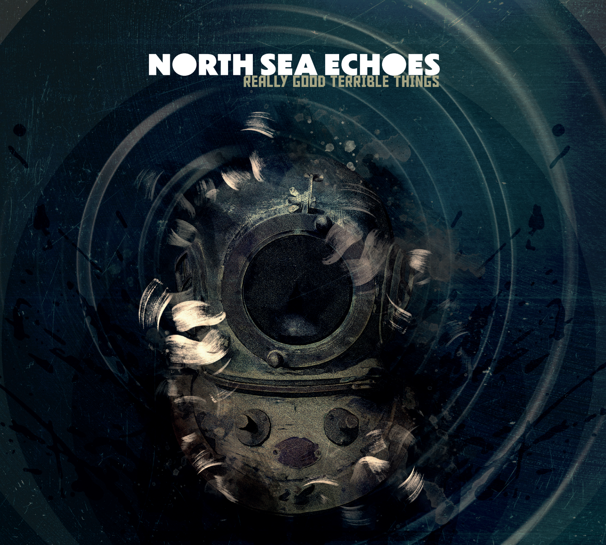
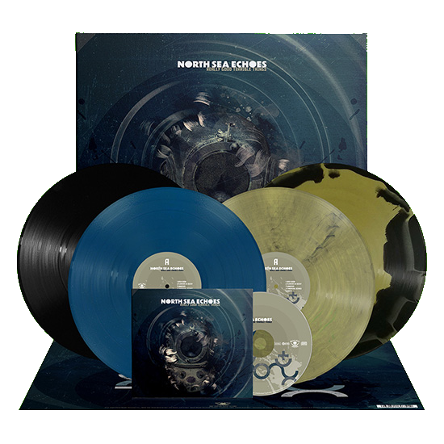

## North Sea Echoes

### Feb. 23, 2024 release date: _Really Good Terrible Things_

**Ray Alder** and **Jim Matheos**’ musical legacy is vast and lauded, both as collaborators and individuals. Alder has been the vocalist and main co-writer for prog metal heroes Fates Warning for the past 35 years. With them he has recorded 10 albums between 1988 (_No Exit_) and 2020 (_Long Day Good Night_). Further rounding out his discography are seven albums with Redemption, two solo albums, and the band A-Z with Mark Zonder, which debuted in 2022.

Prolific and pioneering guitarist/producer Matheos is a co-founder of Fates Warning, the lineup debuting with 1984’s _Night on Bröcken_ on Metal Blade. In addition to 13 albums with Fates, Matheos’ myriad other work includes several solo albums, four albums alongside former Dream Theater keyboardist Kevin Moore, under the name OSI, and new band, Kings of Mercia, a lineup that’s been termed “a hybrid; it’s heavy, but not metal.” 

On **North Sea Echoes**’ debut album, **_Really Good Terrible Things_**, the duo embark upon a fresh musical journey, a new chapter of intimate, moody, and evocative songs highlighted by the singles **“Open Book,” “Empty,” “Throwing Stones.”**  

“Throughout _Really Good Terrible Things_, Matheos and Alder serve up the kind of seductive melancholy Fates Warning fans will recognize,” says Jeff Wagner, author of the Fates Warning book _Destination Onward_. “Yet there's a thoroughly different approach here: vocals are delivered with a sort of nostalgic sadness, and the guitar work is layered in such a way as to feel dreamlike. These are rich sonic landscapes, visiting places haunting, beautiful, spectral and secret. The Matheos/Alder partnership is taken to some new and wonderful places here,” Wagner concludes. 

Matheos and Alder began talking about working together again as soon as they completed Fates Warning’s _Long Day Good Night_. “We just didn’t know what, when, where,” says Matheos. “I had begun work on another Tuesday the Sky record, which is an ambient, mostly instrumental, pet project of mine. But the first songs I’d come up with felt like they were more set up for vocals. Ray and I had done something similar on _Long Day Good Night_, a song called ‘When Winter Falls,’ and we both really liked the outcome. So I asked him if he’d be onto doing a whole record with a similar approach.”

The resultant Really Good Terrible Things was produced by Matheos with cover art from Simon Ward (Kings of Mercia, Marillion). “Open Book” kicks off the record, and was also the first song written. Matheos felt that “with Ray’s lyrics about ending and beginnings, it felt like a good mood to start off with.” Alder adds: “The line ‘we’re a cloud behind the moon’ is referring to the fact that we are all basically an impossibility. Yet here we are. And we will go on until we can’t. I’m speaking of inevitability.”  

The ominous-sounding “Empty” begins with Matheos’ atmospheric guitar work and features a powerful drum performance by Gunnar Olsen (Puscifer). “Throwing Stones,” also with Olsen on drums, sees the pair tapping their vast influences to create one of the most immediate tracks on the record. Lyrically it’s about something called “Cherophobia,” as Alder explains: “Some people have a fear of happiness. They feel that something painful always follows pleasure. So they’re sort of locked into this world where they try to feel nothing, and that’s what Cherophobia is, and what inspired the lyrics.”  

One of Matheo’s favorite tracks is “No Maps.” Matheos had a concept for the lyrics, and Alder took it from there: “The track was much, much different than what ended up on the album. On the demo there was the sound of a freight train quietly moving down the tracks throughout the entire song, along with acoustic guitars. Jim said it reminded him of hobos. So I thought I’d write about a wanderer who is happiest being alone. Kind of romantic to me, in a weird way.”

The songwriting process was as familiar one for the Fates Warning vets: Matheos demos music, then passes it along to Alder. “If he likes the song, he’ll start coming up with lyrics and melodies. After that, the song will tend go through further changes, sometimes minor, sometimes major, as the final form starts to take shape,” explains Matheos.

_Really Good Terrible Things_ shows the breadth and versatility of the acclaimed pair, along with a freshness that belies their long musical partnership. “We both still love making music and we really enjoy working together. There’s a good amount of chemistry there, I think,” Matheos concludes. “We both know what to expect from each other.”

**North Sea Echoes – lineup**  
Jim Matheos – guitar  
Ray Alder – vocals

**North Sea Echoes online**  
[https://northseaechoes.com](https://northseaechoes.com)  
[https://www.metalblade.com/northseaechoes](https://www.metalblade.com/northseaechoes)

**ORDER [HERE](https://www.metalblade.com/northseaechoes)**

**Really Good Terrible Things -- Track List**

1. Open Book
2. Flowers in Decay
3. Unmoved
4. Throwing Stones
5. Empty
6. The Mission
7. Where I'm From
8. We Move Around the Sun
9. Touch the Sky
10. No Maps
