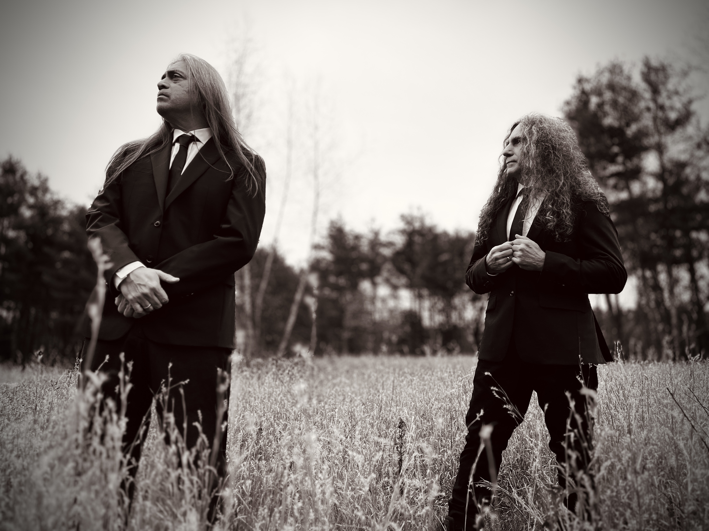

### How to Cast a Shadow (2026)

**Ray Alder: Vocals**  
**Jim Matheos: Guitar / Programming**

On **North Sea Echoes** critically acclaimed 2024 debut, singer Ray Alder and guitarist Jim Matheos garnered raves for songs that possess *"liberating sonic space and emotional vulnerability… from somnambulant electro-fog to gritty, overdriven disquiet, to the quietly devastating."* (**Blabbermouth**)

With 2026's ***How to Cast a Shadow***, North Sea Echoes' identity is further explored and expanded. Matheos explains, *"this record is a bit heavier, with several more songs featuring real drums, played by Dennis Leeflang. It wasn't necessarily intentional or planned, just the way things shaped up and how they emerged this time."*

Alder concurs. *"'I'll Leave a Light On' is much heavier than anything on Really Good Terrible Things, the first NSE album. It has a darker melancholic feel that fits well on this album. I loosely based the lyrics on a character from my favorite sci-fi series. I won't say which, but they do use the quote 'out there in the black.'"*

From the radio-ready rock of *"All That Comes After"* to intimate, escalating *"A Time of Innocence and Purpose"* to the powerful, timeless ballad *"Villains or Saints,"* **How to Cast a Shadow** cohesively crosses genres and challenges aural preconceptions.

The music that became the title track inspired lyricist Alder. *"When Ray sent his ideas for this one, it immediately stood out for me as a title track,"* Matheos says. *"A combination of title/lyrics/ imagery, and the song itself being a bit longer and having a lot of the elements of what NSE sounds like made it a natural choice for me."*

**North Sea Echoes** have been praised for Matheos and Adler *"maintaining their distinctive identity throughout, neither relying on proven past endeavors nor abandoning them completely."* Indeed, the band and **How to Cast a Shadow** use the duo's shared and separate histories to forge a fresh creative opus. Their credits are the stuff of metal legend: Alder has been the vocalist and main co-writer for prog metal heroes **Fates Warning** for 37 years, recording 10 albums between 1988 (***No Exit***) and 2020 (***Long Day Good Night***). Rounding out his discography are seven albums with **Redemption**, two solo records, and the band **A-Z**, which debuted in 2022.

Revered guitar/producer Matheos is a co-founder of **Fates Warning**, the lineup debuting with 1984's ***Night on Bröcken*** on Metal Blade. In addition to 13 albums with **Fates**, Matheos launched several solo albums, four LPs alongside former **Dream Theater** keyboardist Kevin Moore under the name **OSI**, and **Kings of Mercia**, who launched in 2022.

In the last couple years, the ever-prolific Matheos wrote a bunch of material-about 25 songs-track that could perhaps wind up in any one of his musical endeavors. The guitarist and singer were ready to work on what would become the second **North Sea Echoes** album, and *"I started sending Ray batches of this material, and he picked ones he wants to work on,"* Matheos says.

Other standout tracks include *"Enjoy the View."* *"The guitars and drums have this great drive that builds throughout the song."* Alder says. *"The combination of quiet verses and heavy choruses made me think (lyrically) of a darker side to some people. Those who would choose numbness over pain."*

*"Villains Or Saints"* is another band favorite, and **NSE** also feels fortunate that they found the perfect artwork to complement ***How to Cast a Shadow***. Lauded British painter-turned-photographer Chris Friel contributed the cover art. Matheos has worked with Friel in the past (**Arch/Matheos**, **Tuesday the Sky**) and while these particular images were initially intended for a previous **Tuesday the Sky** record, *"when we decided the title for this one we realized those images fit perfectly on How to Cast a Shadow,"* Matheos explains.

Reflecting on **North Sea Echoes**' sophomore album, the duo says, *"I guess you could say that there are elements of everything we do or have done on this album, yet Fates and our various other projects are totally different types of music."* If ***Really Good Terrible Things*** kickstarted **NSE**'s career with *"hovering subtleties, introspective thoughtful reflections"* and lyrics with *"wisdom and authenticity,"* ***How to Cast a Shadow*** ups the promise of its predecessor. Provocative words of hope, sorrow and consciousness are paired with Matheos' equally emotive, varied and deeply moving guitar work.

As Alder sings on *"All Fall Away,"* *"Days blurring into days while bridges turn to rust, nothing flows beneath just stone and dust / And those times we feel more lost than found, more let go than held are the moments we become ourselves."*

*"Let it all fall away let it all turn to gray / Give back that borrowed time and take off that mask / Then turn to face the path ahead."*

### Really Good Terrible Things (2024)

#### HISTORY
**Ray Alder** and **Jim Matheos**’ musical legacy is vast and lauded, both as collaborators and individuals. Alder has been the vocalist and main co-writer for prog metal heroes **Fates Warning** for the past 35 years. With them he has recorded 10 albums between ***1988 (No Exit)*** and ***2020 (Long Day Good Night)***. Further rounding out his discography are seven albums with Redemption, two solo albums, and the band A-Z with Mark Zonder, which debuted in 2022.

Prolific and pioneering guitarist/producer **Matheos** is a co-founder of **Fates Warning**, the lineup debuting with ***1984’s Night on Bröcken*** on Metal Blade. In addition to 13 albums with Fates, **Matheos**’ myriad other work includes several solo albums, four albums alongside former Dream Theater keyboardist Kevin Moore, under the name OSI, and new band, Kings of Mercia, a lineup that’s been termed “a hybrid; it’s heavy, but not metal.”

#### NORTH SEA ECHOES
On **North Sea Echoes**’ debut album, ***Really Good Terrible Things***, the duo embark upon a fresh musical journey, a new chapter of intimate, moody, and evocative songs highlighted by the singles *“Open Book,” “Empty,” “Throwing Stones.”*

*“Throughout ***Really Good Terrible Things***, **Matheos** and **Alder** serve up the kind of seductive melancholy Fates Warning fans will recognize,”* says Jeff Wagner, author of the Fates Warning book Destination Onward. *“Yet there's a thoroughly different approach here: vocals are delivered with a sort of nostalgic sadness, and the guitar work is layered in such a way as to feel dreamlike. These are rich sonic landscapes, visiting places haunting, beautiful, spectral and secret. The Matheos/Alder partnership is taken to some new and wonderful places here,”* Wagner concludes.

**Matheos** and **Alder** began talking about working together again as soon as they completed **Fates Warning**’s ***Long Day Good Night***. *“We just didn’t know what, when, where,”* says **Matheos**. *“I had begun work on another Tuesday the Sky record, which is an ambient, mostly instrumental, pet project of mine. But the first songs I’d come up with felt like they were more set up for vocals. Ray and I had done something similar on Long Days Good Night, a song called ‘When Winter Falls,’ and we both really liked the outcome. So I asked him if he’d be onto doing a whole record with a similar approach.”*

The resultant **Really Good Terrible Things** was produced by Matheos with cover art from Simon Ward (Kings of Mercia, Marillion). ***“Open Book”*** kicks off the record, and was also the first song written. **Matheos** felt that *“with Ray’s lyrics about ending and beginnings, it felt like a good mood to start off with.”* **Alder** adds: *“The line ‘we’re a cloud behind the moon’ is referring to the fact that we are all basically an impossibility. Yet here we are. And we will go on until we can’t. I’m speaking of inevitability.”*

#### REALLY GOOD TERRIBLE THINGS
The ominous-sounding ***“Empty”*** begins with **Matheos**’ atmospheric guitar work and features a powerful drum performance by Gunnar Olsen (Puscifer). ***“Throwing Stones”***, also with Olsen on drums, sees the pair tapping their vast influences to create one of the most immediate tracks on the record. Lyrically it’s about something called *“Cherophobia,”* as **Alder** explains: *“Some people have a fear of happiness. They feel that something painful always follows pleasure. So they’re sort of locked into this world where they try to feel nothing, and that’s what Cherophobia is, and what inspired the lyrics.”*

One of **Matheos**’ favorite tracks is ***“No Maps”***. **Matheos** had a concept for the lyrics, and **Alder** took it from there: *“The track was much, much different than what ended up on the album. On the demo there was the sound of a freight train quietly moving down the tracks throughout the entire song, along with acoustic guitars. Jim said it reminded him of hobos. So I thought I’d write about a wanderer who is happiest being alone. Kind of romantic to me, in a weird way.”*

The songwriting process was as familiar one for the Fates Warning vets: **Matheos** demos music, then passes it along to **Alder**. *“If he likes the song, he’ll start coming up with lyrics and melodies. After that, the song will tend go through further changes, sometimes minor, sometimes major, as the final form starts to take shape,”* explains **Matheos**.

**Really Good Terrible Things** shows the breadth and versatility of the acclaimed pair, along with a freshness that belies their long musical partnership. *“We both still love making music and we really enjoy working together. There’s a good amount of chemistry there, I think,”* **Matheos** concludes. *“We both know what to expect from each other.”*
